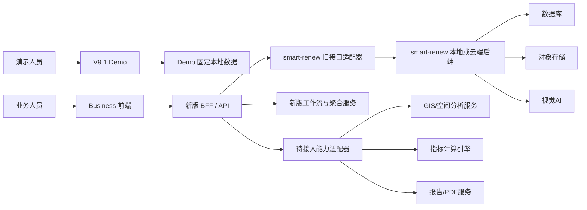
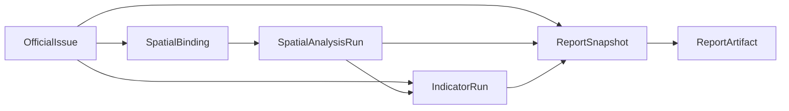

# Urban Health Business 系统架构

> 上位文档：`urban-health-business/readme.md`  
> 适用范围：Demo V9.1 保留、Business 业务模式、BFF适配层及后续独立服务  
> 目标：明确系统边界、运行拓扑、依赖方向和前后端连接方式

## 1. 架构目标

Urban Health Business 以 V9.1 的视觉和六阶段工作台为业务前端，以 smart-renew 现有项目、照片、AI、正式问题、项目数据和报告快照能力为当前后端基础。

架构必须同时满足：

1. 原版 smart-renew 暂不修改；
2. V9.1 Demo 文件和运行逻辑保持不变；
3. Business 模式完全使用真实数据；
4. 前端只依赖新版统一API；
5. 旧接口差异由适配层消化；
6. 当前缺失模块可以先暴露稳定的不可用状态和接口契约；
7. 后续替换数据库、AI、GIS、指标或报告引擎时，不重写业务页面；
8. 本地和云端使用同一业务接口语义。

## 2. 系统上下文



Demo 与 Business 是两个独立应用：

- Demo 不调用新版BFF；
- Business 不加载Demo数据；
- 两者只共享设计语言，不共享运行时状态；
- Demo 数据不得作为 Business 的接口失败兜底。

## 3. 运行拓扑

### 3.1 本地开发

```text
浏览器
  ├─ /demo/       → 新版开发服务器静态提供V9.1快照
  └─ /business/   → 新版Business前端
                         │
                         └─ /api/* → 新版BFF
                                           │
                                           ├─ 适配 smart-renew 本地API
                                           ├─ 提供新版聚合接口
                                           └─ 提供待接入模块能力状态
```

开发端口由新版项目配置决定。Business 前端不得写死 `127.0.0.1` 或端口。

在原 smart-renew 暂不修改的前提下，本地BFF可以通过配置连接原服务：

```text
SMART_RENEW_API_BASE=http://127.0.0.1:4173
```

该地址只存在于服务端环境配置中，不进入浏览器构建产物。

### 3.2 云端部署

```text
静态站点
  ├─ /demo/
  └─ /business/
         │
         └─ 同源 /api
                 │
                 └─ 新版云端BFF
                        ├─ smart-renew云端API适配
                        ├─ CloudBase数据库/对象存储
                        └─ 外部引擎
```

线上不得由浏览器自行判断域名后拼装云函数地址。静态站点通过同源代理或网关暴露 `/api`。

## 4. 逻辑分层

### 4.1 展示层

位置：

```text
apps/business/src/components/
apps/business/src/modules/
```

职责：

- 呈现六阶段工作台；
- 收集用户输入；
- 展示加载、空、失败、阻塞、过期和完成状态；
- 调用应用服务；
- 不直接构造数据库对象；
- 不直接调用 `fetch()`；
- 不计算正式统计和正式得分。

### 4.2 前端应用层

位置：

```text
apps/business/src/app/
apps/business/src/store/
apps/business/src/workflow/
apps/business/src/api/
```

职责：

- 当前项目上下文；
- 页面路由和模式；
- API客户端；
- 前端状态；
- 工作流状态展示；
- 表单草稿；
- 错误恢复；
- 接口能力判断。

前端应用状态只缓存服务端数据，不成为正式数据源。

### 4.3 BFF接口层

位置：

```text
server/routes/
server/middleware/
```

职责：

- 对Business前端提供统一API；
- 参数校验；
- 响应封装；
- requestId；
- 接口版本；
- 错误码转换；
- 幂等键处理；
- 工作流聚合；
- 旧接口适配；
- 能力不可用声明。

### 4.4 业务服务层

位置：

```text
server/services/
packages/workflow-core/
packages/business-models/
```

职责：

- 项目工作流推导；
- 数据完整度；
- 正式归档编排；
- 项目汇总；
- 证据追溯；
- 报告输入快照；
- 后续独立业务能力。

### 4.5 适配层

位置：

```text
server/adapters/smart-renew/
```

职责：

- 调用原 smart-renew 接口；
- 转换路径、字段、ID和返回结构；
- 兼容原接口分页不足；
- 将旧错误转换为新版错误；
- 隐藏本地后端和云函数差异；
- 对缺失旧接口返回明确能力状态。

适配层是临时兼容边界，不得把旧接口字段扩散到Business前端。

### 4.6 外部引擎适配层

后续为以下能力建立独立适配器：

```text
server/adapters/spatial/
server/adapters/indicator/
server/adapters/report/
```

外部引擎未接入时，适配器仍需实现：

- `capabilities`；
- 标准不可用错误；
- 接口说明；
- 前端可识别状态；
- 健康检查。

## 5. 应用边界

### 5.1 Demo应用

允许：

- 使用固定图片、固定地图、固定问题、固定指标；
- 使用自动演示时间轴；
- 浏览器内存状态；
- 离线报告演示。

禁止：

- 写业务数据库；
- 调用Business正式写入接口；
- 被Business作为数据源；
- 与Business共享Store。

### 5.2 Business应用

允许：

- 使用真实项目和真实服务；
- 保存未提交表单草稿；
- 缓存只读查询；
- 显示模块未接入状态。

禁止：

- 引用Demo固定数据文件；
- 使用Demo数据兜底；
- 在后端失败时伪装成功；
- 把浏览器缓存作为正式数据；
- 直接调用CloudBase或模型密钥；
- 在多个页面重复定义统计口径。

## 6. 前端模块结构

Business前端按业务模块组织：

```text
src/modules/project/
src/modules/collection/
src/modules/ai-analysis/
src/modules/review/
src/modules/gis/
src/modules/indicators/
src/modules/reports/
```

每个模块内部建议保持：

```text
components/
pages/
services/
store/
models/
validation/
```

模块只能通过公共业务模型和API契约交互，不得跨模块直接操作另一个模块的内部Store。

## 7. 后端服务边界

### 7.1 项目服务

- 项目列表和详情；
- 项目边界；
- 项目版本；
- 项目汇总；
- 工作流。

### 7.2 资料与照片服务

- 资料登记；
- 照片元数据；
- 对象存储；
- EXIF；
- 位置和空间层级绑定；
- 上传状态。

### 7.3 AI分析服务

- 分析任务；
- 模型调用；
- 任务进度；
- 候选问题；
- 失败重试。

### 7.4 人工复核与正式问题服务

- 复核动作；
- 候选修改；
- 排除和补录；
- 正式归档；
- 正式问题。

### 7.5 空间服务

- 几何保存；
- 坐标转换；
- 空间对象绑定；
- 缓冲区分析；
- 数据来源和分析版本。

### 7.6 指标服务

- 标准指标查询；
- 引擎能力；
- 指标运行；
- 结果查询；
- 输入输出快照。

指标引擎未接入前，仅提供契约和不可用状态。

### 7.7 报告服务

- 报告草稿；
- 报告输入快照；
- 生成任务；
- 版本；
- 交付物；
- HTML/PDF导出。

## 8. 关键数据流

### 8.1 照片到正式问题


候选问题和正式问题必须是独立对象。人工复核不覆盖AI原始输出。

### 8.2 正式问题到报告



报告读取固定快照，不直接读取持续变化的页面状态。

## 9. 配置管理

新版项目配置至少包括：

```text
APP_ENV
APP_API_PREFIX
SMART_RENEW_API_BASE
DATABASE_PROVIDER
STORAGE_PROVIDER
AI_PROVIDER
MAP_PROVIDER
INDICATOR_ENGINE_BASE
REPORT_ENGINE_BASE
```

规则：

- 浏览器只接触公开运行配置；
- 密钥只存在于服务端；
- 缺失配置通过 `/api/meta` 暴露为不可用能力；
- 配置缺失不得自动切换到Demo；
- 本地、测试和生产配置分离。

## 10. 可观测性与运行状态

每个请求至少记录：

- `requestId`；
- 请求路径；
- 项目ID；
- 业务对象ID；
- 响应状态；
- 错误码；
- 耗时；
- 后端适配目标。

异步任务还需记录：

- 任务ID；
- 当前步骤；
- 重试次数；
- 输入快照；
- 引擎版本；
- 失败原因。

`/api/meta` 只报告能力和依赖状态，不返回敏感配置。

## 11. 异步任务

以下能力按异步任务设计：

- 批量照片治理；
- AI分析；
- 大规模空间分析；
- 指标计算；
- 报告生成；
- 数据迁移。

统一任务状态：

```text
queued
running
completed
failed
canceled
```

任务查询必须返回进度、当前步骤、错误和结果引用。

## 12. 文件与媒体

最终上传链路：

```text
前端申请上传
→ 服务端返回上传凭证
→ 前端直传对象存储
→ 服务端登记资产
→ 后续任务只传资产ID
```

过渡期可以适配原Base64上传，但Business接口不得把Base64定义为长期正式契约。

## 13. 数据一致性

统一数据源：

| 页面或结果 | 正式数据源 |
|---|---|
| AI识别统计 | AnalysisCandidate |
| 人工复核统计 | ReviewAction + AnalysisCandidate |
| 正式问题统计 | OfficialIssue |
| GIS问题点 | OfficialIssue + SpatialBinding |
| 指标输入 | OfficialIssue + SpatialAnalysisRun + 项目资料 |
| 报告 | ReportSnapshot |

禁止使用 `AnalysisJob.result.issues` 作为正式项目统计来源。

## 14. 原版能力复用策略

原版能力的完整证据、等级和限制见：

- `docs/original-smart-renew-reuse-audit.md`；
- `docs/reuse-first-ab-development-outline.md`。

原版能力按五类处理：

1. **HTTP直接适配**：现有接口满足核心语义；
2. **纯函数复用**：原版已拆出的无副作用核心由适配层调用；
3. **聚合适配**：BFF组合多个旧接口形成新版接口；
4. **算法最小抽取**：从原单页中抽取地图、POI、AI去重、标注图和报告Renderer；
5. **接口占位**：原版没有对应能力，声明不可用或后续接入。

本次开发只实施审计为A、B等级的能力。C、D等级能力保留为后续待开发或外部模块，不为了表面完成而扩大弱实现。

### 14.1 复用优先级

```text
原HTTP接口
→ 原纯函数核心
→ 原可运行算法最小抽取
→ 原数据与Schema
→ 新开发
```

### 14.2 主数据源

- Project、Photo基础记录和AnalysisRecord继续以上游smart-renew为主；
- AnalysisCandidate、ReviewSession、Business OfficialIssue、SourceAsset、SpatialAnalysisRun和Business Report以Business仓储为主；
- 原`reviewIssues`、`officialIssues`和报告快照只作为初始化、只读兼容或显式迁移来源；
- 禁止同一业务请求无审计写入两个主仓储；
- CloudBase和本地文件仓储通过Provider选择，不能在服务层散落环境判断。

### 14.3 复用不等于回退

原版没有revision、409冲突、幂等、候选级审计、零问题结论、归档只读或stale传播时，继续保留Business现有实现。原`/api/issues/finalize`强制旧指标映射，不作为Business正式问题主写入接口；原`/api/reports/generate`不与Business ReportRepository并行生成新报告。

原版单页算法抽取后必须记录来源、增加回归测试，并从页面全局状态和硬编码配置中解耦。

## 15. 架构禁令

- 不在 `app-v9.1.js` 中增加Business分支；
- 不让Business直接加载Demo图片和固定数据；
- 不把原 `server.mjs` 复制后各自长期演进；
- 不因复用建立第二个可写OfficialIssue、Candidate或Report主数据源；
- 不在前端硬编码本地或云端地址；
- 不在页面硬编码地图Key或SecurityCode；
- 不用全局删除接口实现项目级清理；
- 不用整项目对象覆盖独立业务实体；
- 不将指标标准库误认为完整指标计算引擎；
- 不将原6组问题—指标映射作为正式指标规则；
- 不将POI启发式结论作为指标评分；
- 不在模块缺失时返回伪造成功数据；
- 不用前端多步写入模拟后端事务。

## 16. 架构验收

系统架构达到可实施状态必须满足：

1. Demo和Business有独立入口与依赖；
2. Business只通过统一API访问后端；
3. 新旧接口由适配层隔离；
4. 六阶段使用共同业务模型；
5. 工作流状态可由后端推导；
6. 缺失服务有能力声明和文档；
7. 正式问题是GIS、指标和报告的共同问题源；
8. 报告使用快照；
9. 本地和云端拓扑不改变前端接口；
10. 原版smart-renew文件保持不变。
