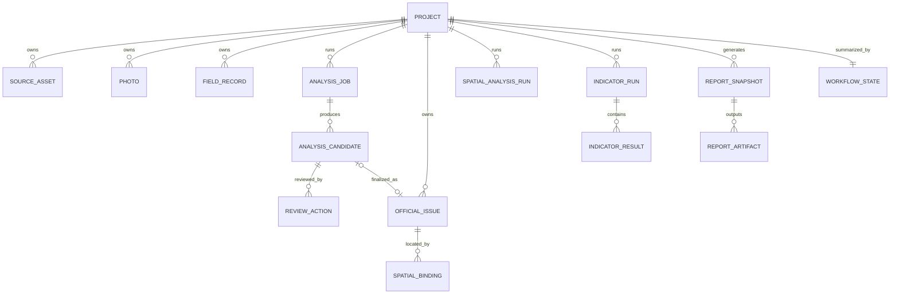

# Urban Health Business 业务数据模型

> 上位文档：`urban-health-business/readme.md`  
> 关联文档：`docs/architecture/system-architecture.md`  
> 目标：定义六阶段共享的对象、关系、状态、版本和正式数据口径

## 1. 建模原则

1. 业务对象使用字符串ID；
2. 所有正式对象可追溯到项目；
3. AI候选与正式问题分离；
4. 原始数据与人工修改分离；
5. 空间分析、指标计算和报告均为版本化运行结果；
6. 页面显示状态不代替业务状态；
7. 项目对象不承载所有子对象；
8. 正式数据以后端为准；
9. 缺失值使用 `null` 或明确状态，不使用Demo值；
10. 对象之间通过ID引用，避免重复嵌入大型数据。

## 2. 总体关系



## 3. 公共字段

所有持久化对象建议包含：

| 字段 | 类型 | 说明 |
|---|---|---|
| `id` | string | 全局或类型范围内唯一ID |
| `projectId` | string | 所属项目；全局字典可为 `"0"` |
| `status` | string | 对象状态 |
| `createdAt` | ISO datetime | 创建时间 |
| `updatedAt` | ISO datetime | 更新时间 |
| `revision` | integer | 乐观锁版本，从1递增 |
| `source` | string | 数据来源 |
| `schemaVersion` | string | 数据结构版本 |
| `createdBy` | string/null | 创建人员 |
| `updatedBy` | string/null | 最后修改人员 |

运行结果类对象额外包含：

| 字段 | 类型 | 说明 |
|---|---|---|
| `inputSnapshotId` | string | 固定输入快照 |
| `engineVersion` | string/null | 引擎版本 |
| `startedAt` | ISO datetime/null | 开始时间 |
| `completedAt` | ISO datetime/null | 完成时间 |
| `error` | object/null | 标准错误 |

## 4. Project

项目是业务归属对象，不直接嵌入完整照片、问题、GIS、指标和报告列表。

建议字段：

```json
{
  "id": "PRJ-001",
  "name": "项目名称",
  "status": "collecting",
  "description": "",
  "cityCode": "",
  "districtCode": "",
  "address": "",
  "boundary": {
    "type": "Polygon",
    "coordinates": []
  },
  "boundaryCrs": "GCJ02",
  "activeStandardLibraryVersion": "1.0.0",
  "createdAt": "",
  "updatedAt": "",
  "revision": 1
}
```

项目状态只做高层提示。六阶段准确状态由 `WorkflowState` 提供。

## 5. SourceAsset

表示项目原始资料。

主要类型：

```text
photo
uav
survey-form
gis-file
route
document
archive
other
```

建议字段：

```json
{
  "id": "AST-001",
  "projectId": "PRJ-001",
  "assetType": "gis-file",
  "name": "项目边界.geojson",
  "mimeType": "application/geo+json",
  "size": 12345,
  "hash": "sha256:...",
  "storageRef": "cloud://...",
  "ingestStatus": "completed",
  "validation": {
    "valid": true,
    "warnings": [],
    "errors": []
  }
}
```

SQLite进入ProjectData时另存`SourceAssetImportRun`审计，不把转换记录塞回SourceAsset元数据：

```json
{
  "id": "ASSETIMP-001",
  "projectId": "PRJ-001",
  "assetId": "AST-001",
  "sourceContentHash": "sha256...",
  "sourceAssetRevision": 1,
  "target": "projectData",
  "format": "sqlite",
  "mode": "append",
  "importedCount": 120,
  "recognizedTables": ["project_data_index"],
  "tableStats": {"project_data_index": 120},
  "importedBy": "",
  "completedAt": ""
}
```

## 6. Photo

照片是独立正式实体，不在分析记录中长期保存Base64。

建议字段：

```json
{
  "id": "PHOTO-001",
  "projectId": "PRJ-001",
  "assetId": "AST-001",
  "kind": "original",
  "name": "现场照片.jpg",
  "mimeType": "image/jpeg",
  "storageRef": "cloud://...",
  "thumbnailRef": "cloud://...",
  "width": 1920,
  "height": 1080,
  "capturedAt": "",
  "capturedAtSource": "exif|manual|file-last-modified|legacy",
  "captureSource": "mobile",
  "exif": {},
  "location": {
    "status": "located",
    "source": "exif",
    "originalCrs": "WGS84",
    "originalCoordinates": [0, 0],
    "displayCrs": "GCJ02",
    "displayCoordinates": [0, 0],
    "accuracyMeters": null
  },
  "communityId": null,
  "buildingId": null,
  "routeId": null,
  "status": "completed"
}
```

`kind` 至少支持：

```text
original
annotated
uav
derived
```

## 7. FieldRecord

表示移动端、外业调查表或人工补录的结构化记录。

建议字段：

```json
{
  "id": "FIELD-001",
  "projectId": "PRJ-001",
  "recordType": "building-survey",
  "communityId": "",
  "buildingId": "",
  "collector": "",
  "collectedAt": "",
  "geometry": null,
  "payload": {},
  "photoIds": [],
  "status": "submitted"
}
```

## 8. AnalysisJob

表示一次AI分析运行。

```json
{
  "id": "AJOB-001",
  "projectId": "PRJ-001",
  "status": "running",
  "photoIds": ["PHOTO-001", "PHOTO-002"],
  "photoSnapshot": [],
  "batchSize": 20,
  "batchCount": 1,
  "batches": [{
    "id": "BATCH-001",
    "batchIndex": 1,
    "photoIds": ["PHOTO-001", "PHOTO-002"],
    "photoSnapshot": [],
    "status": "running",
    "analysisId": null,
    "model": "qwen3-vl-plus",
    "requestId": null,
    "usage": null,
    "promptVersion": null
  }],
  "progress": {
    "total": 2,
    "completed": 0,
    "percent": 0
  },
  "analysisId": null,
  "analysisIds": [],
  "candidateCount": 0,
  "rawCandidateCount": 0,
  "duplicateCandidateCount": 0,
  "models": ["qwen3-vl-plus"],
  "requestIds": [],
  "usage": null,
  "promptVersions": []
}
```

照片超过20张时由服务端执行器自动拆批。每批保存自己的照片证据快照、运行状态和模型元数据；全部批次成功后才形成一个可复核的聚合分析记录。聚合候选按同照片、同分类以及BBox IoU或标题归一化结果去重。任一批次失败时整个任务失败，已完成批次的部分结果不会进入人工复核。

状态：

```text
queued
running
completed
failed
canceled
finalizing
archived
```

## 9. AnalysisCandidate

AI候选问题保留模型原始输出。

```json
{
  "id": "CAND-001",
  "projectId": "PRJ-001",
  "analysisId": "ANL-001",
  "photoId": "PHOTO-001",
  "modelOutput": {
    "problemTypeCode": "",
    "title": "",
    "description": "",
    "severity": null,
    "confidence": null,
    "bbox": null,
    "suggestedIndicatorCodes": []
  },
  "classification": {
    "status": "review",
    "matchedProblemCode": null
  },
  "reviewStatus": "pending",
  "candidateRevision": 1,
  "bbox": [100, 120, 650, 760],
  "annotatedPhotoId": null,
  "annotationUploadSessionId": null,
  "officialIssueId": null
}
```

候选问题不得直接作为项目正式问题统计源。

## 10. ReviewAction

记录人工对候选问题的每次操作。

```json
{
  "id": "REVIEW-001",
  "projectId": "PRJ-001",
  "analysisId": "ANL-001",
  "candidateId": "CAND-001",
  "action": "modified",
  "reviewer": "",
  "reviewedAt": "",
  "before": {},
  "after": {},
  "note": ""
}
```

`action`：

```text
confirmed
modified
excluded
supplemented
reopened
```

## 11. OfficialIssue

正式问题是GIS、指标、报告和后续整改的唯一正式问题源。

```json
{
  "id": "ISSUE-001",
  "projectId": "PRJ-001",
  "analysisId": "ANL-001",
  "candidateId": "CAND-001",
  "problemCode": "PRB-04-01",
  "problemName": null,
  "indicatorCode": null,
  "bindingStatus": "unbound",
  "remediationSnapshot": null,
  "bindingAudit": [],
  "title": "",
  "description": "",
  "severity": 8,
  "severityLabel": "严重",
  "reviewStatus": "confirmed",
  "reviewer": "",
  "originalPhotoId": "PHOTO-001",
  "annotatedPhotoId": "PHOTO-ANNOTATED-001",
  "annotationUploadSessionId": "UPL-001",
  "communityId": null,
  "buildingId": null,
  "geometryStatus": "pending",
  "remediationStatus": "open",
  "status": "open"
}
```

正式问题修改必须增加 `revision` 并保留变更记录。

`problemCode` 为可选人工绑定。`bindingStatus` 为 `unbound|suggested|confirmed|not-applicable`；绑定后由标准库问题类型关系派生 `indicatorCode`，并把整改建议原文、建议类型、责任单位和 `standardLibraryVersion` 冻结到 `remediationSnapshot`。未绑定问题、人工补录问题和零问题结论均为合法状态；绑定操作不生成指标运行结果。

旧问题迁入时使用新的确定性Business ID，并增加`migration.sourceId`、`migration.sourceFingerprint`、`migratedBy`和`migratedAt`。旧`problemCode`和`indicatorCode`只保存为`legacyProblemCode`、`legacyIndicatorCode`来源字段；当前`indicatorCode`仍为`null`。

## 12. SpatialBinding

保存正式问题和真实空间对象的绑定。

```json
{
  "id": "BIND-001",
  "projectId": "PRJ-001",
  "issueId": "ISSUE-001",
  "geometry": {
    "type": "Point",
    "coordinates": [0, 0]
  },
  "crs": "GCJ02",
  "source": "photo-exif",
  "accuracyMeters": null,
  "communityId": null,
  "buildingId": null,
  "parcelId": null,
  "roadId": null,
  "confirmedBy": null,
  "confirmedAt": null,
  "status": "pending"
}
```

状态：

```text
pending
auto_bound
confirmed
adjusted
rejected
```

## 13. SpatialAnalysisRun

保存可复现的空间分析。

```json
{
  "id": "SPRUN-001",
  "projectId": "PRJ-001",
  "type": "poi-search",
  "status": "completed",
  "parameters": {
    "center": [108.95, 34.27],
    "centerCrs": "GCJ02",
    "radiusMeters": 1000,
    "category": "residential",
    "keywords": ["小区", "家园"],
    "boundaryOnly": true
  },
  "providerSnapshot": {
    "provider": "amap",
    "api": "place-around-v3",
    "coordinateSystem": "GCJ-02",
    "queriedAt": ""
  },
  "sourceSnapshot": {
    "projectRevision": 1,
    "boundaryUpdatedAt": "",
    "boundaryCrs": "GCJ02"
  },
  "cleaning": {
    "ruleVersion": "smart-renew-ab-poi-v1",
    "rawCount": 0,
    "acceptedBeforeMergeCount": 0,
    "mergedCount": 0,
    "rejectedCount": 0
  },
  "rawPois": [],
  "result": {
    "itemCount": 0,
    "items": [],
    "rejected": []
  }
}
```

当前实现支持`official-issue-radius`和`poi-search`两类运行。POI运行保存原始Provider响应、清洗拒绝原因和合并结果，不能只保存最终汇总数字；自动清洗结果不是指标得分。

### 13.1 CoordinateTransformRecord

保存原始空间对象到显示坐标系的可追溯转换，字段包括`sourceObject(kind/id/revision)`、
`sourceCrs`、`targetCrs`、`sourceGeometry`、`transformedGeometry`、`method`、
`methodVersion`、`transformedBy`和`createdAt`。转换结果不得覆盖原始Geometry。

### 13.2 SurveyRoute与SurveyStop

`SurveyRoute`保存原始/有效LineString、用于展示的LineString或MultiLineString、CRS、原始采样时间/精度、SourceAsset来源、清洗规则和
`routeRevision`。`SurveyStop`保存候选Point、到离时间、停留时长、检测规则、路线修订、
人工结论和独立`revision`。路线修订不一致时，读模型派生`status: stale`、
`originalStatus`和`staleReasons`，不覆盖历史确认记录。
被拒绝的低精度或异常速度采样会切断显示几何，不会用Polyline跨越异常区间虚构路径。

### 13.3 PhotoRouteBinding

保存照片与路线的时空关联建议，包括距离、时间差、规则版本、照片/路线修订、建议人员、
确认人员、结论和审计修订。建议结果不是正式关联，只有当前修订上的`confirmed`状态可
作为确认关系；路线、照片元数据或照片治理状态变化时派生`stale`。

### 13.4 MapSnapshot

保存确定性地图交付物：

- `purpose`、`mapStyle`、`viewport`和`visibleLayers`；
- 项目、问题、照片、路线、停留节点及分析运行的源修订；
- 可选冻结报告ID与报告版本；
- `queued|running|generated|failed|stale`状态、失败原因、恢复和重试次数；
- SVG内容哈希、内容类型、字节数和存储引用；
- 生成与确认人员、时间和审计信息。

报告型地图快照从报告冻结内容生成；当前业务数据变化不得重写历史报告地图。

正式问题与以上GIS新增模型在`URBAN_HEALTH_PROVIDER=sqlite`时使用统一事务型记录表持久化，按实体、
项目、状态、报告和路线建立索引，并将可提取边界的Geometry同步写入SQLite RTree；
payload保留完整版本化对象。地图快照二进制内容与元数据
分离，可由filesystem或私有S3兼容StorageProvider保存。

## 14. IndicatorRun

指标引擎未接入前仍固定数据契约。

```json
{
  "id": "INDRUN-001",
  "projectId": "PRJ-001",
  "status": "unavailable",
  "engineVersion": null,
  "standardLibraryVersion": "1.0.0",
  "inputSnapshotId": "SNAP-IND-001",
  "resultSummary": null
}
```

状态：

```text
queued
running
completed
failed
canceled
unavailable
stale
```

## 15. IndicatorResult

```json
{
  "id": "INDRESULT-001",
  "projectId": "PRJ-001",
  "runId": "INDRUN-001",
  "indicatorCode": "IND-HOUSE-001",
  "dimension": "HOUSE",
  "value": null,
  "unit": "栋",
  "threshold": null,
  "assessment": "pending",
  "score": null,
  "evidenceRefs": [],
  "missingInputs": []
}
```

`threshold`、`score` 允许为 `null`。

## 16. ReportSnapshot

报告快照固定一次生成输入。

```json
{
  "id": "REPORT-001",
  "projectId": "PRJ-001",
  "reportType": "comprehensive",
  "version": 1,
  "status": "draft",
  "templateVersion": "1.0.0",
  "generatedBy": "",
  "inputRefs": {
    "projectRevision": 1,
    "collectionSnapshotId": "",
    "analysisIds": [],
    "officialIssueRevisions": {},
    "spatialAnalysisIds": [],
    "indicatorRunId": null,
    "standardLibraryVersion": "1.0.0"
  },
  "completeness": {
    "complete": false,
    "missingModules": ["indicator"]
  }
}
```

状态：

```text
draft
generating
generated
failed
stale
archived
migrated_read_only
```

`migrated_read_only`保存完整`migration.originalSnapshot`、来源ID和来源指纹，不允许内容PATCH，也不把旧指标统计转换成当前指标结果。

## 17. ReportArtifact

```json
{
  "id": "ARTIFACT-001",
  "projectId": "PRJ-001",
  "reportId": "REPORT-001",
  "format": "pdf",
  "storageRef": "",
  "size": null,
  "hash": null,
  "generatedAt": "",
  "status": "ready"
}
```

## 18. WorkflowState

```json
{
  "projectId": "PRJ-001",
  "computedAt": "",
  "projectRevision": 1,
  "stages": [],
  "overall": {
    "currentStage": "collection",
    "completedCount": 0,
    "blockedCount": 0,
    "unavailableCount": 1
  }
}
```

工作流为后端计算视图，不作为重复业务数据手工维护。

## 19. 来源与证据引用

证据引用统一使用：

```json
{
  "refType": "photo",
  "refId": "PHOTO-001",
  "relation": "source-image",
  "revision": 1
}
```

`refType` 至少支持：

```text
source-asset
photo
field-record
analysis-candidate
review-action
official-issue
spatial-binding
spatial-analysis
indicator-result
report
```

## 20. 正式数据源矩阵

| 业务信息 | 唯一正式数据源 |
|---|---|
| 项目信息 | Project |
| 资料数量 | SourceAsset / Photo / FieldRecord |
| AI候选数量和置信度 | AnalysisCandidate |
| 人工复核状态 | ReviewAction + AnalysisCandidate |
| 正式问题数量 | OfficialIssue |
| GIS点位 | SpatialBinding |
| 空间统计 | SpatialAnalysisRun |
| 指标值和得分 | IndicatorResult |
| 报告内容 | ReportSnapshot |
| 报告文件 | ReportArtifact |

## 21. 版本与过期

以下上游变化会使下游结果 `stale`：

| 上游变化 | 受影响结果 |
|---|---|
| 照片增加、删除或替换 | AnalysisJob、ReportSnapshot |
| 候选重新复核 | OfficialIssue、SpatialAnalysisRun、IndicatorRun、ReportSnapshot |
| 正式问题修改 | SpatialBinding、SpatialAnalysisRun、IndicatorRun、ReportSnapshot |
| 空间绑定修改 | SpatialAnalysisRun、IndicatorRun、ReportSnapshot |
| 标准库更新 | IndicatorRun、ReportSnapshot |
| 指标引擎或规则更新 | IndicatorRun、ReportSnapshot |
| 报告模板更新 | 新报告版本 |

旧结果不物理覆盖，应保留版本并标记过期。

## 22. 并发与修订

更新对象时前端提交当前 `revision`。

成功：

```text
revision 5 → revision 6
```

若服务端已经是 revision 6，而客户端提交 revision 5：

```http
409 Conflict
```

前端提示重新加载和合并，不自动覆盖。

## 23. 删除规则

- 默认使用归档或软删除；
- 项目级删除必须明确 `projectId`；
- 禁止无条件清空所有分析记录；
- 删除照片前检查分析和报告引用；
- 删除候选不应删除审计记录；
- 正式问题删除应转换为关闭、作废或归档；
- 已被报告引用的对象保留快照引用。

## 24. Demo数据隔离

业务数据模型中不得出现：

- 百分比地图坐标；
- V9.1固定项目ID；
- 固定IMG/DEF/MAP编号；
- 固定问题数；
- 固定分数；
- 固定报告页统计。

Demo对象不迁移为业务数据库种子数据。

## 25. 与smart-renew旧数据映射

适配阶段优先映射：

| 旧数据 | 新对象 |
|---|---|
| project | Project |
| analysis-record | AnalysisJob |
| analysis result issue | AnalysisCandidate |
| photo record | Photo |
| official issue | OfficialIssue |
| report snapshot | ReportSnapshot |
| project-data records | 按 `dataType` 映射到对应新对象或字典 |

旧对象缺失的 `revision`、独立候选ID、空间运行版本等字段由适配层补充兼容值，但正式新写入应使用完整模型。

## 26. 当前待补数据模型

以下模型需要在对应模块大纲中进一步定义：

- 上传会话与分片；
- 空间图层；
- 指标输入快照；
- 指标计算方案；
- 报告模板；
- 整改任务和销项；
- 通用Schema升级与迁移任务队列（LegacyMigrationRun已实现）；
- 通用用户与组织目录（GIS角色和项目范围已通过可信身份头接入）。

## 27. 数据模型验收

1. 六阶段对象关系完整；
2. 候选和正式问题分离；
3. GIS、指标和报告不读取Demo或页面临时值；
4. 正式问题是共同问题源；
5. 运行结果均可记录输入快照和版本；
6. 缺失指标引擎时字段允许为空；
7. 报告可以明确记录缺失模块；
8. 项目对象不承载全部子对象；
9. 更新支持revision冲突；
10. smart-renew旧数据存在明确映射边界。

## 28. NP-05/NP-06 增量模型

### 28.1 ProviderMigrationRun

`ProviderMigrationRun` 使用 `MIGRUN-*` 稳定 ID，保存 `sourceProvider`、`targetProvider`、`sourceRoot`、集合级 `sourceCount/targetCount`、Schema 版本、执行状态、失败项、迁移记录、创建/执行/回滚时间和 `productionVerified`。执行前为计划，必须显式确认；失败不自动删除目标记录，回滚只删除本次运行成功写入且已审计的记录。SourceAsset、地图快照和照片二进制在未完成专项对象存储迁移前保持 reference-only。

### 28.2 OutcomeSummaryReadModel

成果中心是有界、可重新计算的读模型，不是新的业务事实源。它按项目汇总阶段状态、正式问题风险、定位、未绑定编码、分析、空间分析、报告和 stale 状态，并保留 `projectId`、最新报告摘要和来源标记。跨项目查询先应用 RBAC 项目范围，再从 Business 主记录与 legacy 只读记录合并，不能把汇总结果反写为项目事实。

成果汇总同时保存 `projectsTotal`、`projectsLimit`、`projectsTruncated`；总计字段遍历全部可见项目，`projects` 仅保存有界详情。资料口径分别记录 `incompleteCollectionProjectCount`（必需项未完成）和 `collectionWarningProjectCount`（建议项存在警告）。

### 28.3 CloudBase业务Collection契约

Business Collection 使用 `business*` 命名、Schema `1.0.0` 和 `id` 唯一键；索引字段由 `server/providers/cloudbase-provider.mjs` 的集中契约导出。CloudBase SDK 只存在于 Provider/Storage 层，业务服务只能通过 Repository Adapter 访问。AI 配置记录仍保存密文和用户范围元数据，不在迁移或设置接口中返回明文 Key；本地加密主密钥需纳入独立备份恢复清单。

### 28.4 ProviderMigrationRun检查点与回滚标记

迁移运行保存 `lastHeartbeatAt`、`checkpoint`、`interruption`、`migrated` 和 `failures`。`checkpoint` 至少包含当前 Collection、记录索引、已处理数量、成功数量和失败数量；运行状态为 `running` 时视为持有持久租约，只有明确恢复且租约过期才能继续。每条新增目标记录附带 `migrationRunId` 与 `migrationSourceHash`，迁移清单保存 `writtenRecordHash`，回滚只删除标记和哈希均匹配的记录。

### 28.5 StandardBindingAudit

标准绑定审计属于正式问题的项目级子记录。写入使用可信身份的 `actor`、问题修订前后快照、标准库版本和动作；`updatedBy` 等客户端字段只作为请求输入，不覆盖认证身份。读取需要项目查看权限，写入需要 `gis.issue.binding.edit`。
